# 💯 KNU_SW_python_project_team_2
## 💬 주제 : 교통 안전 취약 지역 발굴
### 👤 팀원 : 오승윤, 이상민, 정가온, [허민영](https://github.com/Moomooti)
---
### 📙 프로젝트 이름 및 목적
**🌿 이름** : 이든길  
**🎯 목적** : 다양한 교통 및 재난 위험 요소(지반침하, 침수, 도로결빙, 교통사고 등)를 통합적으로 분석하고, 이를 시각화 및 커뮤니티 기반 정보 공유 기능과 연계하여, 위험 요소에 대한 효과적인 인지와 대응을 지원하는 종합 안전 플랫폼입니다.

---

### 🛠️ 프로젝트 설치 및 실행 방법

1. 저장소 클론
```
git clone https://github.com/gaon0967/KNU_SW_python_project_team_2.git
```
2. 가상환경 생성 및 활성화
```
python -m venv venv
venv\Scripts\activate.bat
```
3. 의존성 설치
```
pip install -r requirements.txt
```
4. `.env` 파일 생성 및 환경 변수 설정
- 프로젝트 루트에 `.env`파일을 생성한 후 아래 내용을 참고해 작성합니다.
```
DJANGO_SECRET_KEY=임의의 문자열
DJANGO_ALLOWED_HOSTS=127.0.0.1,localhost
MAKE_API_KEY=필요 시 입력
SEOUL_API_KEY=임의의 문자열
ODCLOUD_SERVICE_KEY=임의의 문자열
ODCLOUD_API_URL=임의의 문자열
SEOUL_ROAD_EXCAVATION_API_KEY=임의의 문자열
```
5. 서버 실행
```
python manage.py makemigrations
python manage.py migrate
python manage.py runserver
```

---

### 🧰 환경 구축 + 기능 구성 총정리

<details>
  <summary>📚 사용된 라이브러리 </summary>

---

### 📦 웹 개발 및 Django 관련

| 라이브러리 | 설명 |
|------------|------|
| Django     | Python 대표 웹 프레임워크. 웹 페이지, API, DB 관리 등 전반적인 백엔드 처리 |
| sqlparse   | Django 내부에서 SQL 구문을 파싱할 때 사용됨 |
| asgiref    | Django의 비동기 처리 지원 라이브러리 |

---

### 🧠 머신러닝 및 모델 관련

| 라이브러리 | 설명 |
|------------|------|
| xgboost         | 고성능 머신러닝 모델(XGBoost 회귀/분류) 라이브러리 |
| scikit-learn    | ML 알고리즘과 전처리, 모델 평가 기능 제공 |
| joblib          | 학습된 모델을 `.pkl`로 저장/불러오기 위해 사용 |
| numpy, scipy    | 수치 연산, 선형대수 계산 필수 기반 라이브러리 |
| threadpoolctl, threading, tenacity | 병렬 계산 및 내구성 보완용 (간접 사용) |

---

### 🗂 데이터 처리 및 분석

| 라이브러리 | 설명 |
|------------|------|
| pandas               | 표 형태의 데이터 처리 (CSV, Excel 등) |
| openpyxl, et_xmlfile | Excel(xlsx) 파일 처리용 백엔드 |
| matplotlib, seaborn  | 데이터 시각화 (차트, 히트맵 등) |
| pyarrow              | 빠른 I/O 및 파일 포맷 처리 (예: Parquet) |

---

### 🧭 지도 및 위치 데이터 분석

| 라이브러리 | 설명 |
|------------|------|
| folium                              | Leaflet.js 기반의 지도 시각화 (HTML 지도 생성) |
| geopandas                           | 지리정보(GIS) 데이터를 Pandas처럼 처리 |
| shapely                             | 공간 연산 (교차, 면적, 경계 등) 수행 |
| pyproj                              | 위경도 좌표계 변환 |
| rasterio, affine, mercantile, contextily, branca, xyzservices | 공간 타일맵, 배경지도, GeoTIFF 렌더링용 도구들 |

---

### 🌐 크롤링 / 웹 자동화

| 라이브러리 | 설명 |
|------------|------|
| beautifulsoup4       | HTML 구조 파싱 및 정보 추출 |
| requests             | 웹사이트에 요청 보내기 (GET, POST 등) |
| lxml                 | 빠른 HTML/XML 파싱을 위한 parser |
| selenium, webdriver-manager | 브라우저 자동화 도구 (동적 페이지 크롤링 시 사용) |

---

### 🧪 개발 보조 / 콘솔 / 노트북 환경

| 라이브러리 | 설명 |
|------------|------|
| ipython, ipykernel, jupyter_* | Jupyter Notebook 실행 환경 |
| tqdm                        | 반복문 진행 상황 시각화 |
| colorama                    | 터미널 컬러 출력 지원 |
| python-dotenv              | `.env` 파일로 환경변수 관리 |
| watchdog                   | 파일 변화 감지 (개발 자동화 도구에 사용됨) |

</details>

<details>
  <summary>📁 프로젝트 폴더 구조 보기</summary>
  
```
data_B_project/  
├── .venv/  
│   └── 💡 가상환경 (패키지 충돌 방지 및 협업 목적)  
│       - 필요한 라이브러리만 설치 가능  
│       - requirements.txt로 공유 및 관리 용이  

├── data/  
│   ├── people/ 📊 서울시 자치구별 인구수  
│   ├── traffic accident/ 🚗 교통사고 연도별 Excel (2019~2023)  
│   ├── Traffic light/ 🚦 신호등 및 횡단보도 위치  
│   └── 기타 참고 데이터 포함  

├── real_python_project/  
│   ├── db.sqlite3 📦 기본 장고 DB  
│   ├── emergency_agencies.db 🏥 응급기관 DB  
│   ├── final_merged_with_coords.csv ✅ 병합 완료된 최종 CSV  

│   ├── dataAnalysis1.ipynb  
│   │   └── 📈 초기 데이터 분석용 Jupyter 노트북 (pandas, 시각화, 병합 등 실험)  

│   ├── ngrok/  
│   │   └── 🌐 ngrok 실행 및 설정  
│   │       ① make.com 워크플로우용 웹훅 연동  
│   │       ② 외부 접근 가능한 임시 URL 제공  
│   │       ③ 로컬 서버 테스트 자동화를 위한 브리지 역할  

│   ├── emergency_contacts_to_sqlite.py  
│   │   └── 🚑 응급기관 JSON → SQLite 저장 스크립트  
│   │       - 행정안전부 API 기반 254개 기관 정보 수집  

│   ├── requirements.txt  
│   │   └── 📦 필요한 패키지 목록  

│   ├── main/ 💻 Django 앱 구성  
│   │   ├── models.py 모델 정의 (Post, DailyUpdate 등)  
│   │   ├── views.py 요청 처리, API 연동  
│   │   ├── forms.py 사용자 입력 폼  
│   │   ├── model_utils.py 자치구 위험도 예측 함수  
│   │   ├── model_trainer.py 모델 학습 + joblib 저장  
│   │   ├── templates/main/ 템플릿 HTML  
│   │   │   ├── community.html, dashboard_1~4.html, quiz_start.html, rehome.html 등  
│   │   ├── static/images/ 분석 결과 시각화 이미지  
│   │   └── migrations/ DB 마이그레이션  

│   ├── scraper.py 📰 행정안전부 보도자료 크롤링  
│   ├── model_utils.py 예측 수행 + 설명 반환  
│   ├── model_trainer.py XGBoost 학습 후 저장  
│   ├── xgb_model.pkl 저장된 모델  

├── README.md 📘 프로젝트 설명, 실행 방법, 구성도  

```
</details>

<details>
  <summary>🖥️ 실행 화면 </summary>
  
  ### 메인 화면
  
  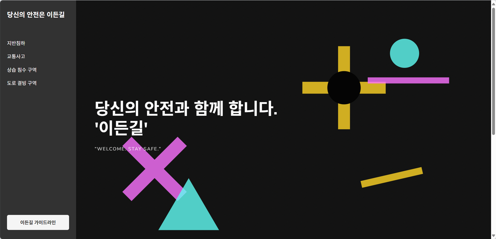

  ### 이든길과의 만남

  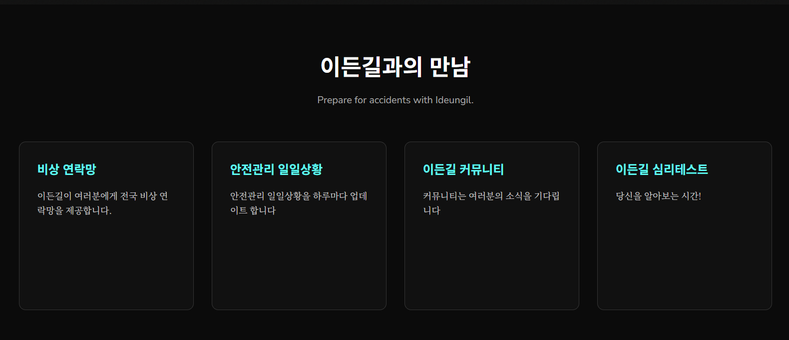

  ### 지반침하

  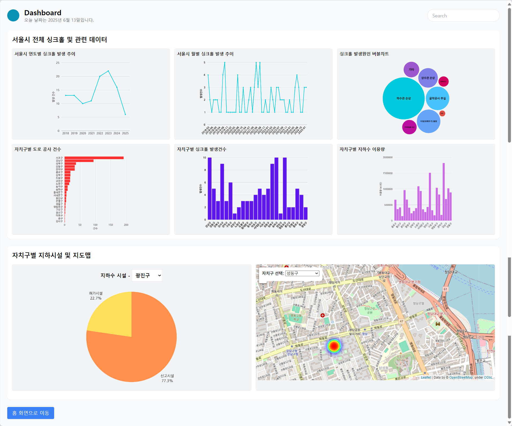

  ### 교통사고

  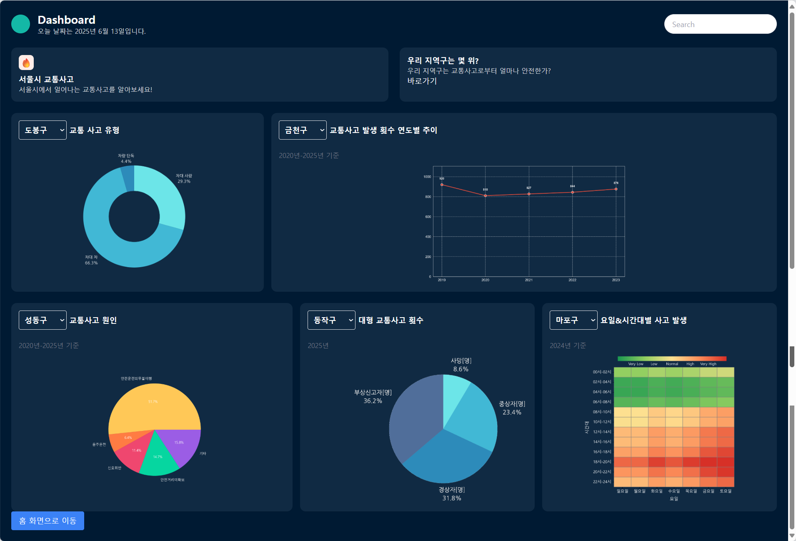

  ### 교통사고 위험도

  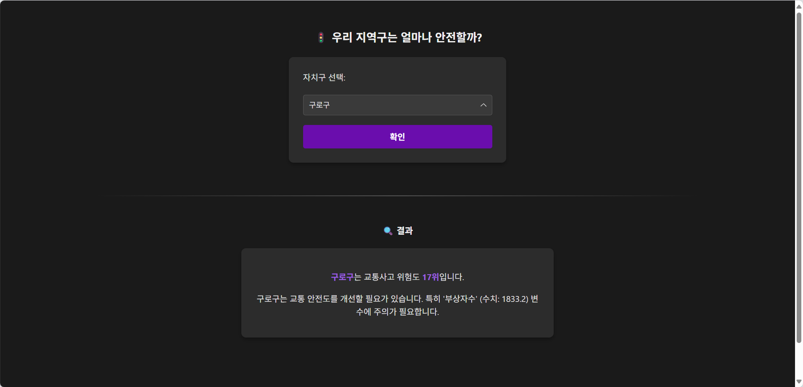

  ### 상습 침수 구역

  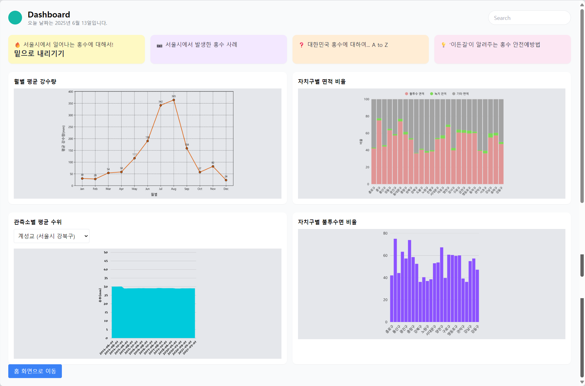

  ### 도로 결빙 구역

  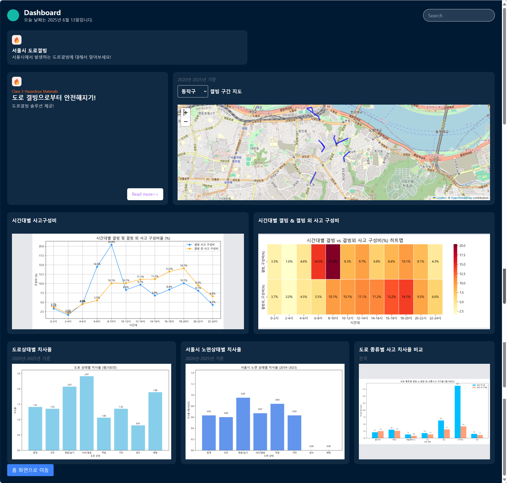

  ### 비상연락기관

  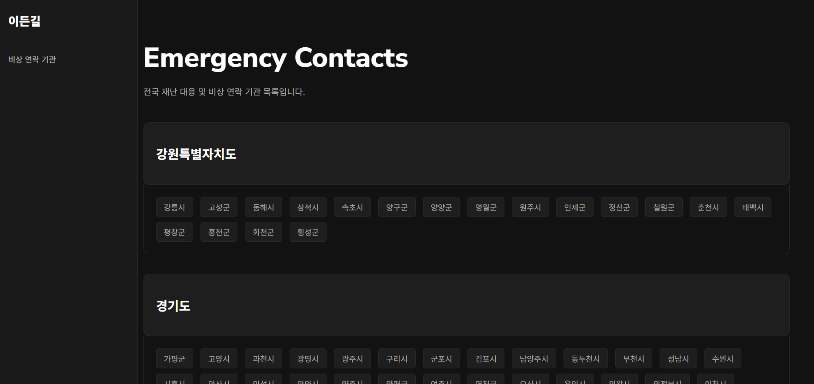

  ### 안전관리 일일상황

  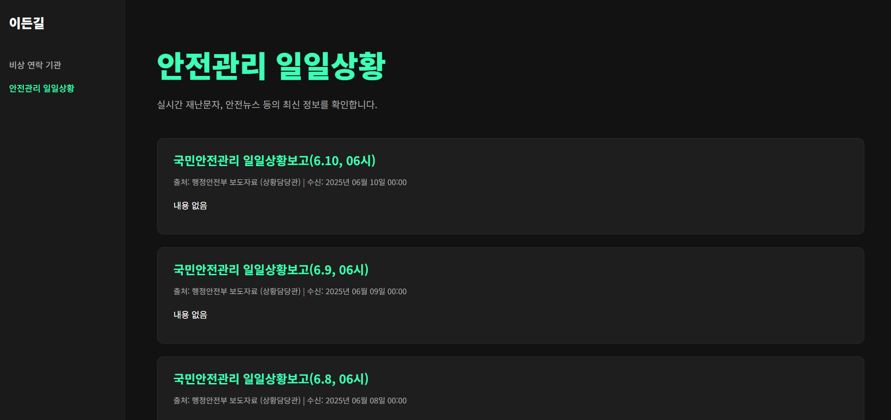

  ### 이든길 커뮤니티

  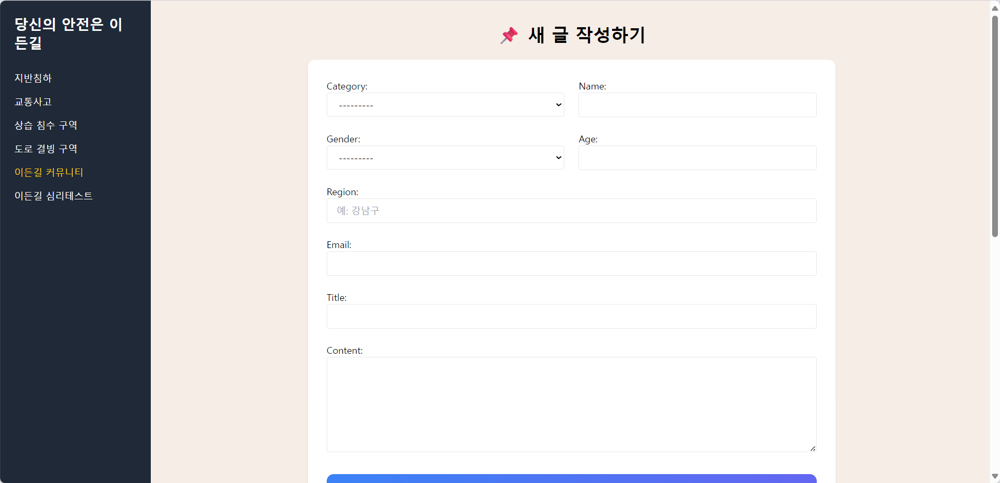

  ### 심리테스트

  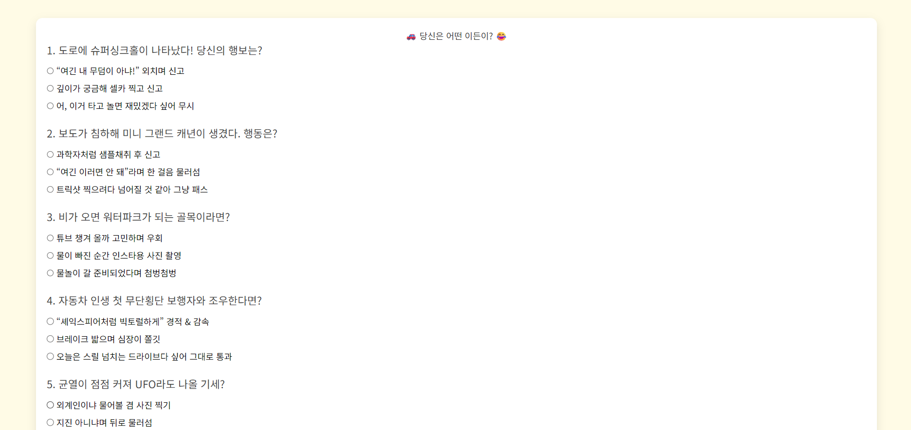

  
</details>

---

### 🤝 회의 내용
<details>
<summary> 📌 첫 번째 회의 내용 </summary>

1. 웹 페이지 UI 공유하기
  
2. 서울시 행정구역 데이터 범위 결정하기  
-> 서울시 행정구역 구 기준으로 결정

3. 데이터 수집하기  

 (1) **교통사고** (교통사고 정보를 위해 모아야 할 데이터)  
  - 사고 발생 위치 (GIS 좌표), 시간, 유형 (차대차, 차대사람 등)  
  - 사고 원인, 피해 규모 (사망, 중상, 경상 등)  

 (2) **싱크홀 및 지반 침하 위험 지역 데이터** (싱크홀 정보를 위해 모아야 할 데이터)  
  - 과거 싱크홀 발생 이력 (위치, 규모, 원인)  
  - 지반 조사 자료 (지질도, 지하수위 변동, 지반 특성 등)  
  - 상하수도관 노후도 및 누수 발생 이력  
  - 대규모 지하 개발 공사 현황 (지하철, 터널 등)  

 (3) **기타 위험 요인**  
  - 급경사지  
  - 상습 침수 구역  
  - 낙석 위험 지역  
  - 도로 결빙

우리 지역 -> 안전도 테스트
  
4. 역할 분담 및 만날 날짜
  - **데이터 전처리 및 데이터 분석** : 이상민, 허민영
  - **Django를 활용한 웹페이지 구축** : 정가온
  - **데이터 시각화 자료 및 발표 피피티 제작** : 오승윤
  - **다음 회의 일정** : 5/15 파이썬 수업 후
</details>
<details>
  <summary>📌 두 번째 회의 내용 (5/15) </summary>

  - 데이터 수집 목록 확인
  - 추가 데이터 있는지 살펴보기
      - 추가 데이터 있을 시 조건
      1. 추가 데이터 목록을 모두와 공유하기
      2. 추가 데이터도 동일하게 다같이 모아야함
  - 웹 프로토타입 살펴보기
  - 다음주까지 해와야 할 것들
      - 승윤: 이든길 가이드라인 표 작성하기
      - 민영, 상민: 싱크홀 및 지반침하 데이터 분석 완료 파일 완성해서 오기
      - 가온: 웹 페이지 4개 HTML로 작성하기
</details>
<details>
  <summary>📌 세 번째 회의 내용 (5/18) </summary>
  
  - 데이터 수집 결과 공유
  - 가이드라인 작성한 것 공유
  - 웹 페이지 어디까지 진행했는지 공유
  - 데이터 분석 오늘부터 시작

  - 화요일까지 웹페이지 담당자 : 웹페이지 두개 구축
  - 데이터 분석 담당자 : 다음주 목요일까지 싱크홀 분석
</details>
<details>
  <summary>📌 네 번째 회의 내용 (5/22) </summary>

  - 웹 페이지 구축 2개 확인하기
  - 데이터 분석 파트 나눈 거 이야기하기
  - 데이터 분석 현황

  - 다음주 목요일까지
  - 민영: 싱크홀 .ipynb파일 -> 시각화한테 넘기기
  - 상민: .ipynb파일 -> 시각화한테 넘기기
  - 가온: 파일 4개 구축하기
  - 승윤: 시각화 시작
</details>
<details>
  <summary>📌 다섯 번째 회의 내용 (6/3) </summary>
  
  - 승윤, 상민: 시각화 자료 넘겨받으면 시각화 할 수 있는 데까지 해오기
  - 가온: 장고로 메인 페이지 제작, 4개 페이지 연결, 가능하면 가이드라인 버튼까지.
  - 민영: 싱크홀 최대한 해오기

  - 위 기능 검사하기
</details>
<details>
  <summary>📌 마지막 회의 내용 (6/12) </summary>
  
  - 웹 페이지 전체 확인하기
  - 깃허브 다시 꾸미기
  - 배포 여부
  - 피피티 제작 및 발표 준비하기
</details>

- **페이지 디자인 1 : [figma_1](https://www.figma.com/design/EVlEsAvssMzduNOMQqq03p/Data-##Visualization-Package--Community---Community-?m=auto&t=EaSnN1FVl4JoH4ck-6)**  
- **페이지 디자인 2 : [figma_2](https://www.figma.com/design/R1xDkiDhgZPlxjdtCBAjMT/Best-Websites-of-2023---Webflow-%7C-Figma-Design--Community-?node-id=0-1&t=PXqxduq8GY0n6Wz7-1)**

---
### 🛤️ 이든길 가이드라인
<details>
  <summary>🛡️ 이든길 이용 가이드</summary>

- 대시보드를 통해 재난 데이터를 확인하세요.
- 비상연락망은 클릭 한 번으로 접근할 수 있어요.
- 커뮤니티에 의견을 자유롭게 남기세요!
</details>
<details>
  <summary>💡 ‘이든길’이 알려주는 홍수 안전 예방법</summary>
  
**기상 특보 확인:** 호우 예보 시 TV, 라디오, 스마트폰 앱 등으로 기상 특보를 수시로 확인하세요.  
**비상 물품 준비:** 손전등, 라디오, 비상식량, 구급약품, 휴대폰 충전기 등을 미리 준비해둡니다.  
**가스/전기 차단:** 침수 위험이 있을 경우, 주택 내 가스와 전기를 미리 차단합니다.  
**지하 공간 대피:** 지하 주차장, 반지하 주택 등 지하 공간은 침수 시 매우 위험하므로 즉시 대피합니다.  
**하천변/계곡 접근 금지:** 갑자기 불어난 물에 휩쓸릴 수 있으니 하천변이나 계곡 주변은 절대 가까이 가지 마세요.  
**차량 이동 자제:** 침수된 도로는 진입하지 말고, 불가피할 경우 우회하거나 대중교통을 이용합니다.  
**농경지/시설물 점검:** 비닐하우스, 농경지, 축사 등 시설물을 미리 점검하고 취약 부분은 보강합니다.  
**대피 경로 확인:** 거주 지역의 대피 장소와 경로를 미리 숙지하고, 재난 시에는 관계 당국의 안내에 따릅니다.  
※ 이든길은 여러분의 안전을 최우선으로 생각합니다. 재난 발생 시 안전 수칙을 준수하세요.  
</details>
<details>
  <summary>❓ 대한민국 역사 속 주요 홍수 사건들</summary>

**1925년 을축년 대홍수:** 일제강점기 기록된 가장 큰 홍수 중 하나. 한강 범람으로 서울 도심 대부분이 침수되고 큰 인명 피해가 발생했습니다.  
**1984년 중부지방 집중호우:** 수도권과 강원 지역에 기록적인 폭우가 쏟아져 많은 이재민과 재산 피해가 발생했습니다.  
**1987년 8월 대홍수:** 태풍과 장마가 겹치면서 남부지방을 중심으로 큰 피해가 발생, 섬진강 유역의 피해가 특히 컸습니다.  
**1990년 전국적인 홍수:** 여름 장마와 태풍으로 전국적으로 동시다발적인 홍수 피해가 발생, 농경지 침수와 이재민이 다수 발생했습니다.  
**2002년 태풍 루사:** 강원도를 중심으로 기록적인 폭우를 동반하여 엄청난 인명 및 재산 피해를 남겼습니다. 역대급 재난 중 하나로 기록됩니다.  
**2011년 우면산 산사태:** 서울 우면산 일대에 집중호우가 발생하여 산사태로 인한 인명 피해와 주택 침수가 발생했습니다.  
**2020년 장마철 집중호우:** 중부지방을 중심으로 50일 넘는 긴 장마가 이어지며 누적 강수량이 역대급을 기록, 하천 범람 및 산사태 피해가 컸습니다.  
**2022년 수도권 집중호우:** 서울 강남 등 수도권 도심에 기록적인 시간당 폭우가 쏟아져 지하철역, 도로, 주택 침수 등 큰 혼란이 발생했습니다.  
※ 위 내용은 주요 사건의 예시이며, 실제 역사는 더 많은 홍수 피해를 기록하고 있습니다.  
</details>
<details>
  <summary>❄️ 도로결빙 주의하는 방법 ❄️</summary>
  
**감속 운전:** 빙판길에서는 평소보다 20~50% 이상 감속해야 합니다.  
**안전거리 확보:** 평소보다 2배 이상 충분한 안전거리를 유지하세요.  
**급조작 금지:** 급출발, 급가속, 급제동, 급핸들 조작은 피해야 합니다.  
**미끄럼 방지 장비:** 스노체인, 스노타이어 등 미끄럼 방지 장비를 준비하세요.  
**블랙 아이스 주의:** 육안으로 식별하기 어려운 블랙 아이스를 특히 조심해야 합니다. (교량 위, 터널 출입구, 응달진 곳)  
**대중교통 이용:** 가급적 대중교통을 이용하는 것이 안전합니다.  
</details>

---

### 📑 데이터 분석
『이든길』프로젝트의 시작은 바로 **데이터 분석**과 **1차 시각화 작업**이었습니다.  
이를 위해 팀원들을 `.ipynb` 파일을 사용해 분석과 시각화를 동시에 수행하였습니다.  

`.ipynb` 파일을 선택한 이유는 다음과 같습니다.
- 코드, 설명, 수식, 결과를 한 파일에서 관리 가능
- 시각화된 결과를 바로 확인 가능
- 협업과 공유에 용이

**🧑‍💻 분석 주제 및 구성**  
데이터 분석은 총 4개지 주요 재난 유형을 중심으로 진행되었습니다:
- 지반 침하  
- 교통사고  
- 상습 침수 구역  
- 도로 결빙

이상민 학생과 허민영 학생이 위 주제들을 나누어 담당했으며,  
총 20개 이상의 셀과 200개가 넘는 시각화 자료가 제작되었습니다.

**🗂️ 데이터 수집 방식**  
데이터는 총 3가지 방법으로 수집하였습니다:  
<details>
  <summary>🔍 상세 수집 방식 보기</summary>

  1. **웹 크롤링**  
  - `requests`+`BeautifulSoup`조합으로 HTML 데이터 파싱  
  2. **공공데이터포털 API 활용**  
  - 인증키 기반의 JSON 응답 구조  
  - `requests.get()`으로 호출 후 `json()` 파싱  
  3. **CSV 파일 수동 다운로드**  
  - 분석에 익숙하지 않은 팀원도 쉽게 활용 가능  
  - `pandas`를 사용하여 불러온 뒤 필요한 컬럼만 추출 및 전처리 수행  
</details>

**🧹 데이터 전처리 및 변환**
<details>
  <summary>🧼 주요 전처리 사례 보기</summary>
  
**📁 CSV 전처리**
- **서울시 월별 강수량 데이터**  
  - 상위 8줄 불필요한 헤더 제거 후 컬럼 직접 지정  
  - `년월`컬럼은 `pd.to_datetime()`으로 날짜 변환  
  - '강수량'값 중 숫자가 아닌 항목은 pd.to_numeric(errors='coerce')로 NaN 처리
  - `dropna()`로 결측값 제거 후 분석 진행
</details>

**🗺️ 공간 데이터 활용**  
침수지역 분석에서는 공간 벡터 데이터인 `.shp`(Shapefile)을 활용했습니다.
<details>
  <summary>🧭 공간 분석 방식 보기</summary>

  - 서울시 침수흔적도 데이터 활용
  - `geopandas`로 `.shp`파일 불러오기
  - 좌표계 변환 : `EPSG:4326 → EPSG:3857`
    → 실제 웹 지도와 정확히 겹치도록 설정
  - `matplotlib` + `contextily` 조합으로 시각화
    - `cs.add_basemap()`으로 지도 타일 추가
    - `total_bounds`로 자동 확대 비율 설정
</details>

---

### 🖼️ 데이터 시각화

이상민, 허민영 학생이 분석한 `.ipynb`파일을 시각화 담당 오승윤 학생이 전달받아 **총 200개 이상**의 데이터를 깔끔하게 정리하였습니다.

<details>
  <summary>🕳️ 지반침하</summary>

  ### 싱크홀

  싱크홀.png)

  ### 싱크홀 자치구별

  싱크홀_자치구.png)
</details>

<details>
  <summary>💥 교통사고</summary>

  ### 사고 유형

  교통사고-사고유형.png)

  ### 발생 건수

  교통사고-발생건수.png)

  ### 히트맵

  교통사고-히트맵.png)

  ### 원인

  교통사고-원인.png)

  ### 사상자

  교통사고-사상자.png)
  
</details>

<details>
  <summary>🌧️ 상습침수</summary>

  ### 상습침수

  상습침수.png)

  ### 관측소별 평균 수위

  상습침수-관측소.png)

</details>
<details>
  <summary>❄️ 도로결빙</summary>
  
  ### 도로결빙

  도로결빙.png)
  
</details>

---

### 🌱 추가 핵심 구현 기능
<details>
  <summary>📞 1. 전국 단위 재난 대응 비상연락망 구축</summary>

  - **개요**:  
  재난 상황에서 필요한 지역별 비상연락망 정보를 제공하기 위해, 이를 데이터베이스로 구조화하였습니다.
- **주요 구현 과정**:
  1. `request` 라이브러리를 통해 JSON 데이터 요청 및 응답 수신  
  2. 각 데이터에 광역 지자체명을 기준으로 지역 분류  
  3. `pandas`를 활용해 데이터프레임으로 정리  
  4. 정리된 데이터를 `SQLite3` 데이터베이스로 저장  
- **특징**:
  SQLite 방식으로 구현해 별도의 서버 환경 없이 **로컬 테스트와 관리가 간편**하며, 총 **254개 기관**의 연락처 데이터를 효율적으로 관리할 수 있게 되었습니다.

</details>

<details>
  <summary>🌐 2. 실시간 재난 정보 자동 수집 시스템 (Make.com 기반)</summary>
  
  - **개요**:  
  매일 업데이트되는 **국가 재난 사이트의 안전관리 일일상황 보고서**를 자동 수집하여 로컬 웹페이지에 연동하는 자동화 시스템을 구현하였습니다.  
- **사용 기술 및 흐름**:  
  - Make.com의 HTTP 모듈로 JSON API 요청 → HTML 응답 수신  
  - **정규표현식**을 활용해 제목, 본문, 출처 등 필요한 정보 추출  
  - Django API 엔드포인트에 POST 요청 전송  
  - ngrok을 활용해 로컬 테스트 환경에서 외부 접근 테스트 수행  
  - Make 플랫폼 API 키를 사용하여 안전한 연동 수행  
- **핵심 성과**:  
  매일 실시간으로 최신 재난 정보를 사용자에게 제공할 수 있는 **자동화된 데이터 파이프라인 구축**에 성공
  <details>
    <summary>🖥️ 구성 화면</summary>
    
    ### MCP

    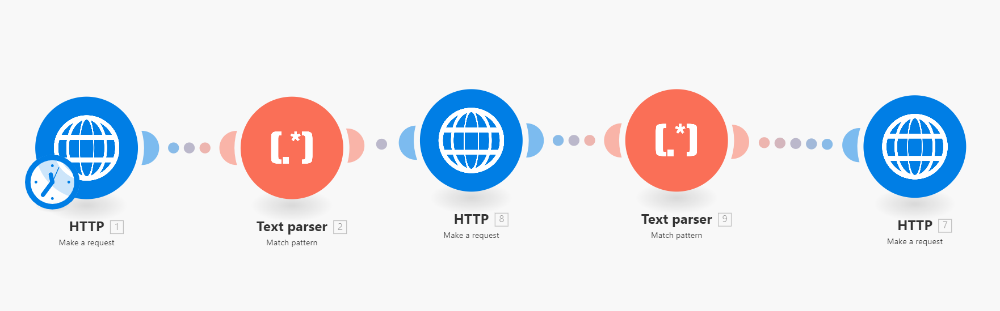

    .png)

    .png)

    .png)

    .png)

    ### ngrok

  1. Django 서버를 로컬에서 실행
  2. ngrok으로 외부 공개 (예: https://abcd1234.ngrok.io)
  3. 자동화 플랫폼(Make, n8n 등)에서 Webhook을 만들어 https://abcd1234.ngrok.io/your-endpoint/ 로 POST 테스트
  
    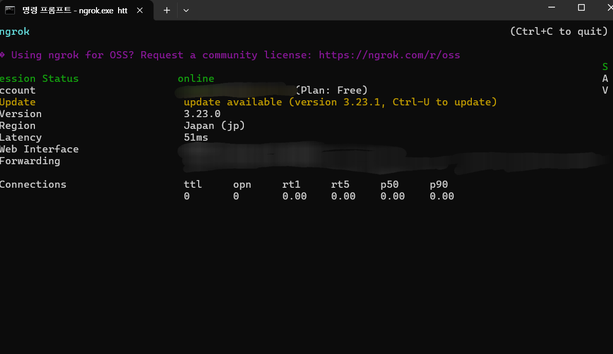
  </details>
  
</details>

<details>
  <summary>🧠 3. 교통사고 위험도 예측 기능 (XGBoost 기반)</summary>
  
  - **개요**:  
  서울시 25개의 자치구의 교통사고 발생 건수를 예측하는 **머신러닝 기반 모델**을 구현하여, 사용자에게 **지역별 사고 위험도 정보**를 제공할 수 있도록 하였습니다.  
- **모델 구현 과정**:  
  - 인구, 사망/부상자 수, 신호등/횡단보도 수 등 다양한 데이터를 `merged_df.csv`로 통합  
  - `XGBoost` 모델 학습 및 `feature_importances_`속성으로 변수 중요도 시각화
     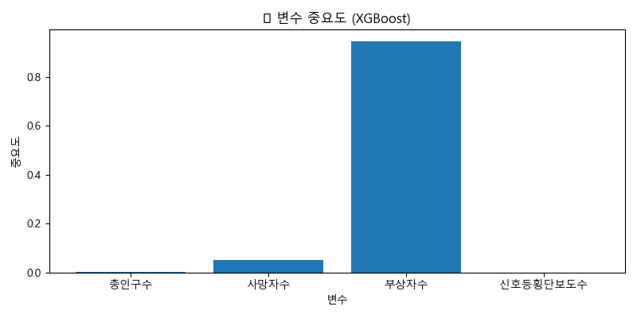
  - 예측 결과를 Django 웹과 연동하여 사용자 입력에 따라 실시간 출력
  
- **웹페이지 기능**:  
  - 입력된 자치구의 **예측 교통사고 건수 출력**  
  - 서울 전체 중 해당 자치구의 **상대 순위 표시**  
  - 예측에 영향을 미친 **주요 요인 시각화 및 설명 제공**
- **주요 인사이트**:  
  '사망자 수', '부상자 수'가 높은 중요도를 가지며, '신호등 및 횡단보도 수'는 예방 관련 요인으로 분석
  
  
</details>

<details>
  <summary>🙋 4. 사용자 참여를 위한 커뮤니티 & 심리테스트</summary>

  - **커뮤니티 게시판**:  
    - **자유 게시판**과 **위험 경험 공유 게시판**으로 구성  
    - 게시글 작성/수정/삭제 기능과 DB 저장 기능 구현  
    - 사용자의 실제 경험과 의견을 나눌 수 있는 공간 제공  
  - **심리테스트 기능**:  
    - 사용자의 **재난 인식 수준**, **대응 유형** 등을 재미있게 알아볼 수 있도록 설계  
    - 단순 정보 제공을 넘어, **참여 유도형 안전 교육 플랫폼**으로서의 역할 수행
      

  
    
</details>

---

### 🤯 시행착오 

『이든길』프로젝트를 진행하면서 저희는 다양한 시행착오를 겪었습니다.  
원래는 데이터 분석 뿐만 아니라 LLM, 즉 대형 언어 모델을 활용한 스마트 분석 플랫폼을 구축하려고 했습니다.  
초기 기획에서는 HTML 기반 웹사이트에 Streamlit이라는 도구를 연동해보고자 했지만,  
조사해 본 결과 HTML 환경에서는 Streamlit 연동이 어렵다는 사실을 알게 되었습니다.  
이에 따라 대안을 찾던 중, '그렇다면 Flask를 이용해볼까?'라는 생각으로 직접 코드를 짜 보았지만,  
기존에 사용하던 Django 웹 프레임워크와는 서로 연동이 되지 않는 구조라는 점에서 또 한번의 어려움에 부딪혔습니다.  
이러한 한계 상황 속에서 우리는 LLM 연동 대신, MCP(Make.com) 자동화 도구와 파이썬 기반 머신러닝 모델 개발이라는 새로운 방향으로 프로젝트의 무게중심을 옮기게 되었습니다.  

---

### 🚀 향후 방향성

『이든길』 프로젝트는 이번 결과물에 그치지 않고,  
지속적인 개선과 확장을 통해 더욱 실용적인 재난 대응 플랫폼으로 진화하고자 합니다.  
이를 위해 다음과 같으 향후 계획을 세우고 있습니다:  

**📌 1. 자동화 플랫폼의 진화: Make → n8n**
- 현재 Make.com을 활용하여 자동화 시스템을 구축했지만,  
  모듈 수 제한과 요금제의 제약으로 인해 일부 기능은 충분히 구현하지 못한 아쉬움이 남았습니다.  
- 이에 따라, 향후에는 설치형 자동화 플랫폼인 n8n을 도입하여  
  더 복잡하고 유연한 워크플로우를 구현할 계획입니다.  
- n8n은 최근 각광받고 있는 오픈소스 기반 자동화 도구로,  
  커스터마이징에 강점을 가지고 있어 향후 서비스 확장에 큰 도움이 될 것입니다.  

**📌 2. 실시간 정보 수집 시스템으로 확장**
- 현재는 하루 1건의 일일 보고서 수집만 가능하지만,  
  앞으로는 다양한 정부 기관, 언론사, 공공 플랫폼으로부터  
  재난 속보, 공지, 기사 등을 자동으로 수집 및 분류하는 시스템을 구축할 계획입니다.  
- 이를 통해 사용자는 보다 다양하고 실시간성 있는 정보를 제공받을 수 있게 될 것입니다.  

**📌 3. 머신러닝 모델의 고도화**
- 이번 프로젝트에서 처음으로 XGBoost 기반 머신러닝 모델을 구현해보았지만,  
  데이터의 양과 변수 구성 측면에서 아쉬움이 남았습니다.  
- 향후에는 더 많은 특성과 외부 데이터를 반영한 확장형 예측 모델을 구축하고,
  다양한 알고리즘을 실험하여 성능을 더욱 향상시킬 예정입니다.

**📌 4. 배포**
- 현재는 개발 단계이기 때문에 로컬 테스트 기반으로 구성되어 있지만,
  향후에는 클라우드 서버(AWS, Render 등)를 이용한 정식 배포를 계획하고 있습니다.
- 배포 이후에는 ngrok과 같은 임시 터널링 없이도,  
  외부 시스템과의 Webhook 연동을 항상 안정적으로 제공할 수 있게 됩니다.

이처럼 『이든길』은 단순한 데이터 시각화 플랫폼을 넘어,  
예측 - 자동화 - 사용자 인터랙션까지 아우르는  
통합형 스마트 재난 대응 시스템으로 발전해 나가고 있습니다.

